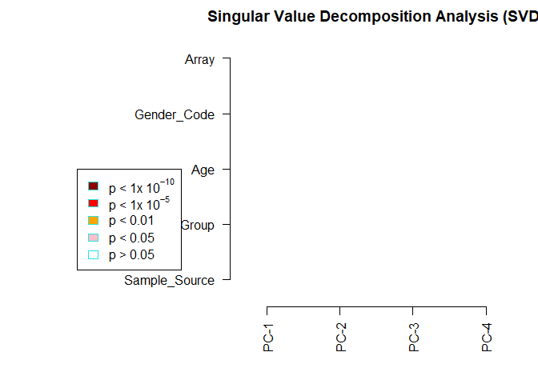

## Introduction

This markdown file records me practicing using the **chAMP** package.  
There are 8 samples being analyzed, which are cfDNA from 4 healthy
volunteers and 4 lung cancer patients. The sentrix_ID is 205379740133,
and all samples are included in it.

#### Loading and filtering data

``` r
library(ChAMP)
```

``` r
myLoad <- champ.load(directory = "C:/InfiniumMeth/testsample/205379740133", arraytype = "EPIC")
```

    ##        Failed CpG Fraction.
    ## HV_C_1         0.0025822307
    ## HV_C_2         0.0017322656
    ## HV_C_3         0.0019355181
    ## HV_C_4         0.0013280703
    ## LC_C_1         0.0007876034
    ## LC_C_2         0.0013038186
    ## LC_C_3         0.0060894912
    ## LC_C_4         0.0465852425

Notice that the last sample, LC_C\_4, has a rather high proportion of
failed probes, which might affect the downstream analysis.  
According to the `champ.filter()` criteria, there are some probes being
filtered out:  
1. A detection p-value above 0.01: **42312** probes  
2. A beadcount \<3 in at least 5% of samples: **9046** probes  
3. non-CpG probes: **2406** probes  
4. Probes with SNPs using general EPIC SNP list according to Zhou’s
Nucleic Acids Research Paper 2016: **93441** probes  
5. Probes that align to multiple locations that identified in Nordlund
et al: **11** probes  
6. Probes located on X,Y chromosome: **15885** probes

There are a total of **702817** probes remained after filtering.

#### Quality control and Normalization

``` r
champ.QC(PDFplot = FALSE)
```


The beta value distribution of LC_C\_4 in the density plot, which is
quite different from the others, may be caused by the high proportional
of failed probes.

``` r
myNorm <- champ.norm(arraytype = "EPIC", cores = 5)
```

The default method of normalization is
[BMIQ](https://pubmed.ncbi.nlm.nih.gov/23175756/).

``` r
champ.QC(beta = myNorm, PDFplot = FALSE)
```


#### Singular value decomposition and batch effect correction

To see if the variation of the data comes from any technical sources
besides the biological factors of our interest, a SVD test is performed.

``` r
myNorm <- as.data.frame(myNorm)
champ.SVD(PDFplot = FALSE)
```



    ##      Sample_Source Sample_Group       Age Gender_Code     Array
    ## [1,]     0.4288799   0.56370286 0.3286227   0.2482131 0.4288799
    ## [2,]     0.4288799   0.24821308 0.3286227   0.2482131 0.4288799
    ## [3,]     0.4288799   0.08326452 0.3286227   1.0000000 0.4288799
    ## [4,]     0.4288799   0.24821308 0.3957757   0.5637029 0.4288799

It shows that after deconvolution, the first 2 components captured about
80% of variance. In concordance with the SVD analysis plot, implying
that there is a minor need to deal with batch effects. It is reasonable
since eight samples are all on the same slide.

#### Identification of defferential methylation probes

``` r
champ.DMP(arraytype = "EPIC")
```

    ##       Contrasts
    ## Levels pLC-pHV
    ##    pHV      -1
    ##    pLC       1

    ## Error in champ.DMP(arraytype = "EPIC"): ChAMP.DMP Have not detected even one significant CpGs. You may try other threshold.

It turns out that there are no significant CpGs detected.  
To see if the result is caused by the inclusion of the sample with poor
quality (i.e. LC_C\_4), LC_C\_4 is excluded from the data and the
analysis is re-performed.
